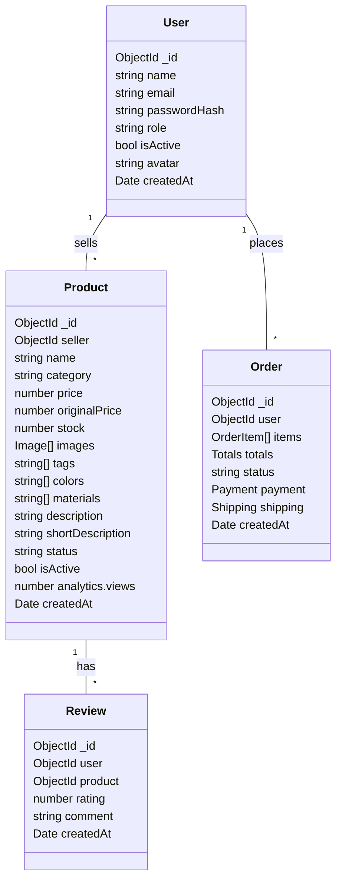

# CraftKart – Handmade Crafts & Art Marketplace

Use this as the source for your PPT/Slides. Each numbered section corresponds to a slide (or a small group of slides). Replace bracketed placeholders and add screenshots.

---

## 1. Title Slide
- **Project Title**: CraftKart – Handmade Crafts & Art Marketplace
- **Team**: [Your Name(s)]
- **Guide/Supervisor**: [Name]
- **Department / Semester**: [Dept, Year, Sem]
- **Date**: [Date]

---

## 2. Introduction / Overview
- **Domain**: E‑commerce marketplace for handmade goods.
- **Purpose**: Connect artisans with buyers through a modern, secure, AI‑assisted platform.

---

## 3. Objectives
- **Improve discovery** with AI: text suggestions, image-based search, visual matches.
- **Streamline seller workflow**: simple product listing, Cloudinary media uploads.
- **Ensure reliability**: orders, payments, admin controls.
- **Great UX**: responsive UI, quick filters, admin CSV/print exports.

---

## 4. Problem Statement
- Manual/legacy marketplaces struggle with product discovery and curation.
- Sellers face friction uploading media and managing inventory.
- Buyers cannot search by image or get relevant recommendations.

---

## 5. Existing System (Drawbacks)
- Keyword-only search; poor recall.
- Limited media handling; inconsistent product quality.
- Minimal admin insights; difficult oversight.

---

## 6. Proposed System (CraftKart)
- **Buyer**: text/image search, filters, cart, wishlist.
- **Seller**: add/edit products, image uploads, inventory.
- **Admin**: manage users/products/orders, CSV/print.
- **AI**: `/api/ai/search-suggest`, `/api/ai/analyze-image`, `/api/ai/search-by-image` with fallbacks when AI quota is exceeded.

---

## 7. System Analysis
- **Hardware**
  - Dev: 8 GB RAM+, quad-core CPU, stable internet.
  - Prod: 1–2 vCPU+, 2–4 GB RAM API, managed MongoDB, CDN for static/media.
- **Software**
  - Node.js 18+, MongoDB 6+, npm, React 18, Express, TailwindCSS, Cloudinary, SendGrid/SMTP, PayU sandbox.
- **Functional**
  - Auth, product CRUD, search & filters, cart/checkout, order processing, admin dashboard, AI endpoints.
- **Non-Functional**
  - Availability ≥ 99%, p95 < 500ms for catalog/search.
  - Security: JWT, HTTPS, CORS, rate limiting.
  - Scalability: pagination, indexes, CDN, horizontal scaling.

---

## 8. System Design – Architecture Diagram
```mermaid
flowchart LR
  U[Browser (React)] -->|REST/HTTPS| API[Node/Express API]
  API --> DB[(MongoDB)]
  API --> CLD[(Cloudinary)]
  API --> SMTP[(SendGrid SMTP)]
  API --> PAY[(PayU)]
  API --> OAI[(OpenAI API)]
  subgraph Client
    U
  end
  subgraph Server
    API
  end
```

---

## 8. System Design – ER/Entities Overview


---

## 9. Implementation – Technology Stack
- **Frontend**: React 18, React Router, React Query, TailwindCSS, Lucide icons
- **Backend**: Node.js, Express, Mongoose
- **Database**: MongoDB
- **Media**: Cloudinary (`server/utils/cloudinary.js`)
- **Email**: SendGrid (`server/utils/email.js`)
- **AI**: OpenAI SDK (`server/utils/openai.js`), routes in `server/routes/ai.js`
- **Payments**: PayU (test env), `.env` managed secrets

---

## 9. Implementation – Key Modules (Files)
- `client/src/components/layout/Navbar.js`: search bar with AI text suggestions and camera upload for image search
- `client/src/pages/ProductPage.js`: listings, filters, visual matches mode (from image)
- `server/routes/products.js`: product CRUD, Cloudinary image uploads
- `server/routes/ai.js`: `POST /analyze-image`, `POST /search-by-image`, `POST /search-suggest`
- `server/index.js`: middleware, CORS, rate limiting, routes

---

## 9. Implementation – API Endpoints (Sample)
- `GET /api/products?search=&category=&sort=&page=&limit=`
- `POST /api/products/:id/images` (Cloudinary)
- `POST /api/ai/analyze-image` (multipart image) → `{ analysis, tags, similarProducts }`
- `POST /api/ai/search-by-image` → `{ imageUrl, analysis, similarProducts }`
- `POST /api/ai/search-suggest` → `{ suggestions }`

---

## 10. Testing
- **Methods**: Unit (utils/controllers), Integration (routes), UAT (end‑to‑end)
- **Key test cases**
  - AI suggest returns ≤5 results; fallback to product names when AI down
  - Image analyze fallback from filename tokens when Vision quota hit
  - Product image upload persists URLs and renders on `ProductPage`
  - Admin Users CSV/Print includes filtered data

---

## 11. Results / Output
- Screens: Home, Products (grid/list, filters), Product Detail, Cart, Seller Add/Edit, Admin Users/Orders/Products
- AI UX: text suggestions and camera upload → visual matches (with graceful fallback)

---

## 12. Conclusion
- Achieved: full buyer/seller/admin flows; media handling; AI‑assisted discovery; fallbacks for resilience
- Value: better discoverability and seller productivity; modern UX

---

## 13. Future Enhancements
- Embeddings-based similarity (name/desc vectors) to improve visual matches
- Personalized recommendations (history + embeddings)
- Observability dashboards; tracing
- Returns/refunds workflows; dispute handling
- Caching (Redis), job queues (BullMQ), CDN optimizations

---

## 14. References / Bibliography
- React, React Query, TailwindCSS docs
- Express, Mongoose docs
- Cloudinary docs
- OpenAI API docs
- SendGrid docs
- PayU integration docs

---

## Appendix A – Screenshots to Add (placeholders)
- Navbar search with camera icon (client)
- Products page: normal search and visual matches header
- Seller Add Product: ₹ symbol in Pricing & Inventory
- Admin Users: Download CSV + Print buttons
- Admin Orders: printable report

---

## Appendix B – Setup & Run (for demo)
- **Server**: `npm run dev` in `server/` (requires `.env` with MongoDB, Cloudinary, SendGrid, PayU, OpenAI)
- **Client**: `npm start` in `client/`
- Open: `http://localhost:3000`

---

## Appendix C – Risks & Mitigations
- **AI Quota/429**: server fallbacks (filename tokens), user toasts, retries/backoff
- **Image CORS/availability**: host on Cloudinary, robust client placeholders
- **Security**: secrets in `server/.env`, JWT, HTTPS in prod, rate limiting
